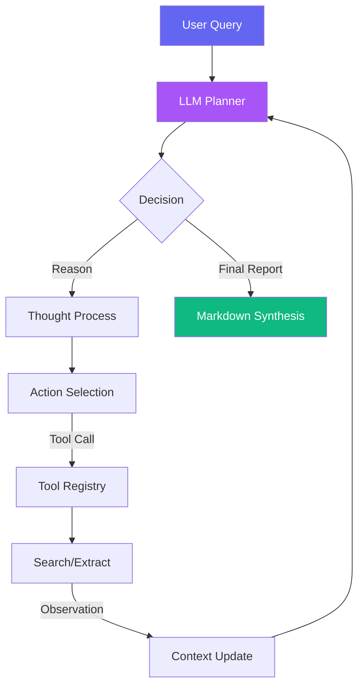

# 🧠 IntellectAI - Advanced Research Assistant

[](https://www.python.org/downloads/)
[](LICENSE)
[](#architecture)
[](CONTRIBUTING.md)

> **A production-grade, zero-framework Agentic AI platform for deep research synthesis and autonomous information discovery.**

---

## 📋 Table of Contents

- [Overview](#-overview)
- [Key Features](#-key-features)
- [Architecture](#️-architecture)
- [Getting Started](#-getting-started)
- [Usage](#-usage)
- [Configuration](#️-configuration)
- [Project Structure](#-project-structure)
- [API Reference](#-api-reference)
- [Deployment](#-deployment)
- [Roadmap](#️-roadmap)
- [Contributing](#-contributing)
- [License](#-license)
- [Acknowledgments](#-acknowledgments)

---

## 🌟 Overview

**IntellectAI** is an advanced autonomous research assistant that leverages the **ReAct (Reason + Act)** paradigm to perform deep information synthesis. Unlike traditional RAG systems that simply retrieve and concatenate text, IntellectAI employs an intelligent agentic loop to:

- **Autonomously navigate** the web to find relevant information
- **Cross-reference multiple sources** for accuracy and completeness
- **Detect contradictions** between sources like a senior analyst
- **Generate comprehensive research reports** with academic-grade citations
- **Provide transparent reasoning** with full audit trails of decision-making

Built from the ground up without heavy frameworks like LangChain or CrewAI, IntellectAI demonstrates that **clean engineering beats framework complexity** through raw API calls, maximum observability, and minimal latency.

---

## ✨ Key Features

### 🔬 Advanced Research Capabilities
- **Autonomous Research Agent**: Self-directed information gathering using ReAct architecture
- **Dynamic Tool Registry**: Strictly-typed system with automatic OpenAI function schema handling
- **Multi-Source Synthesis**: Cross-references information from multiple web sources
- **Contradiction Detection**: Identifies and flags conflicting information across sources
- **Traceable Reasoning**: Complete audit trail of every agent decision and action

### 🏗️ Engineering Excellence
- **Zero Framework Bloat**: No LangChain, CrewAI, or AutoGen - pure Python engineering
- **Production-Grade Code**: Comprehensive error handling, retries, and logging
- **Maximum Observability**: Every thought, action, and observation is logged
- **Optimized Performance**: Minimal latency through direct API implementations
- **Type Safety**: Pydantic-powered data validation throughout

### 💻 Developer Experience
- **Beautiful CLI**: Rich-powered terminal interface with real-time status updates
- **Web Interface**: Modern, responsive UI with glassmorphism design
- **Markdown Reports**: Auto-generated research reports with proper formatting
- **Usage Tracking**: Built-in token usage statistics and cost monitoring
- **Easy Configuration**: Environment-based configuration with sensible defaults

---

## 🏗️ Architecture

IntellectAI implements the **Agentic Loop** pattern - a proven architecture for autonomous AI agents:



### Core Components

| Component | Description | Location |
|-----------|-------------|----------|
| **Agent Core** | ReAct loop orchestrating the research process | `agent/core.py` |
| **LLM Client** | Resilient API client with automatic retries | `agent/llm.py` |
| **Tool Registry** | Dynamic tool management system | `tools/base.py` |
| **Search Tool** | Tavily-powered web search | `tools/search.py` |
| **Extract Tool** | URL content distillation | `tools/extract.py` |
| **Data Models** | Pydantic validation schemas | `models/schemas.py` |

---

## 🚀 Getting Started

### Prerequisites

Before installing IntellectAI, ensure you have:

- **Python 3.10 or higher**
- **Deepseek API Key** - [Get one here](https://platform.deepseek.com/)
- **Tavily API Key** - [Get one here](https://tavily.com/) (optimized for AI research)

### Installation

```bash
# Clone the repository
git clone https://github.com/agentic-saim09/AI-Research-Assistant
cd IntellectAI

# Create a virtual environment (recommended)
python -m venv venv
source venv/bin/activate  # On Windows: venv\Scripts\activate

# Install dependencies
pip install -r requirements.txt

# Set up environment variables
cp .env.example .env
# Edit .env and add your API keys
```

### Quick Start

```bash
# Run from command line
python main.py "Comparative analysis of Llama 3.1 vs. GPT-4o architecture"

# Or run interactively (will prompt for topic)
python main.py
```

---

## 💡 Usage

### Command Line Interface

IntellectAI provides a powerful CLI with rich output:

```bash
# Basic usage
python main.py "Your research topic here"

# Example: Technology research
python main.py "Impact of quantum computing on cybersecurity"

# Example: Scientific research
python main.py "CRISPR gene therapy advancements 2024"

# Example: Market research
python main.py "Global electric vehicle market trends"
```

### Web Interface

IntellectAI includes a beautiful web UI:

```bash
# Start the FastAPI server
python -m uvicorn api.index:app --reload

# Visit http://localhost:8000
```

The web interface features:
- Modern glassmorphism design
- Real-time status updates
- Markdown rendering
- One-click report copying

### Programmatic Usage

```python
from agent.core import ResearchAgent
from agent.llm import LLMClient
from tools.base import ToolRegistry
from tools.search import SearchTool
from tools.extract import ExtractTool

# Initialize components
registry = ToolRegistry()
registry.register_tool(SearchTool())
registry.register_tool(ExtractTool())

llm_client = LLMClient()
agent = ResearchAgent(llm_client, registry)

# Run research
report = agent.run("Your research topic")
```

---

## ⚙️ Configuration

Create a `.env` file in the root directory:

```env
# API Configuration
DEEPSEEK_API_KEY=sk-your-api-key-here
TAVILY_API_KEY=tvly-your-api-key-here

# Model Settings
MODEL_NAME=deepseek-chat
MAX_ITERATIONS=10

# Logging
LOG_LEVEL=INFO
```

### Environment Variables

| Variable | Description | Default | Required |
|----------|-------------|---------|----------|
| `DEEPSEEK_API_KEY` | Your Deepseek API key | - | ✅ |
| `TAVILY_API_KEY` | Your Tavily API key | - | ✅ |
| `MODEL_NAME` | LLM model to use | `deepseek-chat` | ❌ |
| `MAX_ITERATIONS` | Maximum agent iterations | `10` | ❌ |
| `LOG_LEVEL` | Logging verbosity | `INFO` | ❌ |

---

## 📂 Project Structure

```
IntellectAI/
├── agent/                      # Core agentic AI components
│   ├── __init__.py
│   ├── core.py                # ReAct Agent Loop (The Heart)
│   ├── llm.py                 # LLM Client with Retry Logic
│   ├── prompts.py             # System Prompts
│   └── config.py              # Configuration Management
├── tools/                      # Tool ecosystem
│   ├── __init__.py
│   ├── base.py                # Abstract Tool Interface & Registry
│   ├── search.py              # Tavily Web Search
│   └── extract.py             # URL Content Extraction
├── models/                     # Data models
│   ├── __init__.py
│   └── schemas.py             # Pydantic Validation Schemas
├── api/                        # Web API endpoints
│   └── index.py               # FastAPI server & routes
├── tests/                      # Test suite
│   └── (test files)
├── output/                     # Generated reports (auto-created)
├── main.py                     # CLI Entry Point
├── index.html                  # Web Interface
├── requirements.txt            # Python dependencies
├── vercel.json                 # Vercel deployment config
├── .env.example                # Environment template
├── .gitignore                  # Git ignore rules
├── README.md                   # This file
├── LICENSE                     # MIT License
└── CONTRIBUTING.md             # Contribution guide
```

---

## 🔌 API Reference

When running the FastAPI server, IntellectAI exposes the following endpoints:

### POST `/api/research`

Initiate a research task and receive a comprehensive report.

**Request Body:**
```json
{
  "topic": "String - The research topic"
}
```

**Response:**
```json
{
  "report": "String - Complete markdown research report",
  "usage": {
    "total_tokens": 1234,
    "input_tokens": 800,
    "output_tokens": 434
  }
}
```

### Interactive API Docs

Visit `/docs` when the server is running to explore the full API with Swagger UI.

---

## 🌐 Deployment

### Deploy to Vercel

IntellectAI is ready for serverless deployment:

```bash
# Install Vercel CLI
npm i -g vercel

# Deploy
vercel
```

The included `vercel.json` handles routing automatically.

### Deploy to Any Platform

```bash
# Using uvicorn directly
uvicorn api.index:app --host 0.0.0.0 --port 8000

# Or using gunicorn for production
gunicorn api.index:app -w 4 -k uvicorn.workers.UvicornWorker
```

---

## 🗺️ Roadmap

### Planned Features
- [ ] **Parallel Search Planning**: Dispatch multiple search queries simultaneously to reduce latency
- [ ] **Recursive Depth Control**: Self-adjusting research depth based on query complexity
- [ ] **Source Verification**: Advanced grounding against original URL content
- [ ] **Multi-Format Export**: PDF, HTML, and JSON report generation
- [ ] **Caching Layer**: Intelligent caching to reduce API costs
- [ ] **Custom Tools**: Plugin system for domain-specific research tools
- [ ] **Batch Processing**: Research multiple topics in one session
- [ ] **Analytics Dashboard**: Visual insights and research metrics

### Under Consideration
- Support for additional LLM providers (OpenAI, Anthropic, etc.)
- Academic paper integration (arXiv, PubMed)
- Knowledge graph generation
- Collaborative research sessions

---

## 🤝 Contributing

We welcome contributions! Please see our [Contributing Guide](CONTRIBUTING.md) for details on:

- How to set up the development environment
- Our coding standards and practices
- The pull request process
- How to report bugs and suggest features

**Types of contributions we're looking for:**
- Bug fixes
- New research tools
- Performance optimizations
- Documentation improvements
- Test coverage

---

## 📄 License

This project is licensed under the MIT License - see the [LICENSE](LICENSE) file for details.

---

## 🎓 Philosophical Note

IntellectAI was built to demonstrate a fundamental truth: **clean engineering > complex frameworks**. 

By understanding and implementing the raw loop of an agent from scratch, you gain:
- **Power**: Complete control over behavior and optimization
- **Reliability**: No hidden framework bugs or limitations
- **Transparency**: Every decision is visible and debuggable
- **Cost Efficiency**: Zero overhead means lower API bills

This is production-ready code that respects your intelligence and your users' time.

---

## 🙏 Acknowledgments

- **ReAct Architecture**: Inspired by the groundbreaking paper [ReAct: Synergizing Reasoning and Acting in Language Models](https://arxiv.org/abs/2210.03629)
- **Tavily**: For providing an AI-optimized search API
- **Deepseek**: For powerful and cost-effective LLM capabilities
- **FastAPI**: For the modern, fast web framework
- **Rich**: For beautiful terminal interfaces

---

<div align="center">

**Built with ❤️ and intelligence**

[Report Bug](https://github.com/agentic-saim09/AI-Research-Assistant) · [Request Feature](https://github.com/agentic-saim09/AI-Research-Assistant) · [Documentation](https://github.com/agentic-saim09/AI-Research-Assistant)

</div>

---

---

---

---

---

## Author & Contact

- **Author:** Agentic Saim
- **GitHub:** [@agentic-saim09](https://github.com/agentic-saim09)
- **Email:** [agenticsaim.work@gmail.com](mailto:agenticsaim.work@gmail.com)
- **Profile:** https://github.com/agentic-saim09

